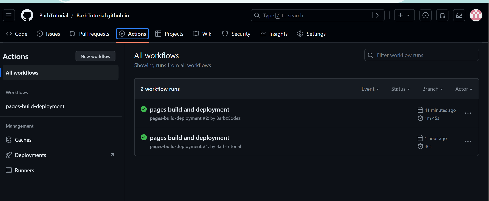
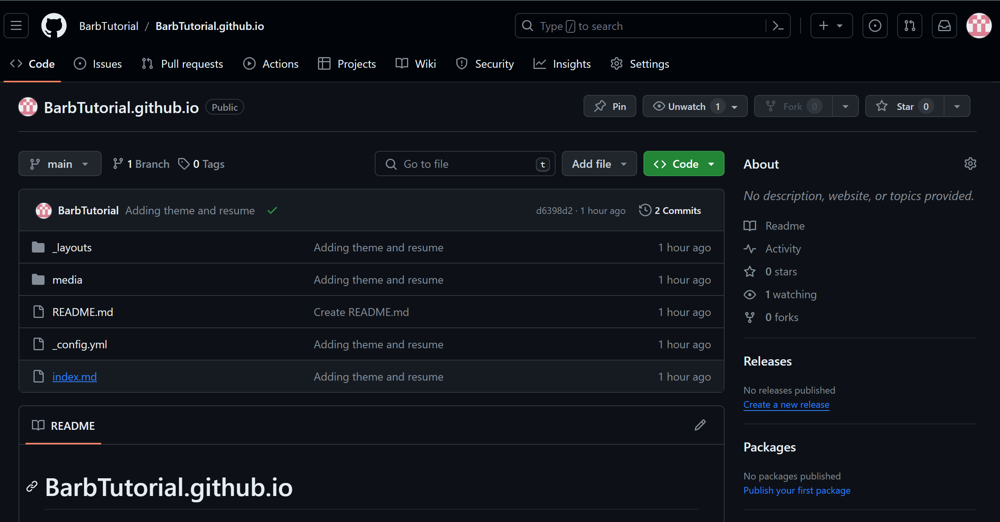

# Hosting a Resume on GitHub Pages


According to Andrew Etter in [Modern Technical Writing](https://www.amazon.ca/Modern-Technical-Writing-Introduction-Documentation-ebook/dp/B01A2QL9SS) we want to "make the content beautiful, discoverable and searchable", this will guide you to host a themed markdown resume using GitHub Pages to achieve Etter's goal.

## Prerequisites

Before we start the project make sure to have all of the following:

- **A Resume Formatted in Markdown**: This is the resume that is going to be shown.
  - If you already have a resume in PDF or word document checkout the [convertors listed](#convert-your-resume-to-markdown).
  - To make the process more smoothly, use the sample resume on [index.md](/index.md) as template, because the theme we are going to be using works with that template.
  - For more information checkout the [template section](#template) on the resources.
- **Git**: This is how you can make changes locally and push them to GitHub.
  - You can download it [here](https://git-scm.com/download/win).
- **GitHub Account**: This is where your resume is going to be hosted.
  - If you need an account go to [GitHub SignUp](https://github.com/signup).
  - If you are new to GitHub checkout the [GitHub Resources](#github) for a quick start.
- **Visual Studio Code**: This where you can edit your resume and use both Git and GitHub seamlessly.
  - You can download it [here](#visual-studio-code-vs-code).

---

## Instructions

Now that you have all the prerequisites, lets begin!

### Making a Repository (Repo)

In your browser, login to your Github account.

1. Go to [github.com](https://github.com/).
2. On your left panel click on **Create Repository**.
3. Create a repository with name in this format: `YourGitHubUsername.github.io`.
   - In the example below, my username is: _BarbTutorial_, so the name of my repo is going to be `BarbTutorial.github.io`.
4. Click on the checkmark that says **Add a Readme**
5. Click on **Create a Repository**.

Once this is done, you will see your repo with a readme.


---

### Cloning your Repo to Visual Studio Code

> Before starting, make sure you have [Git](https://git-scm.com/download/win) and [Visual Studio Code](https://code.visualstudio.com/download) downloaded.
> As well as [connecting your GitHub account to Visual Studio Code](https://code.visualstudio.com/docs/sourcecontrol/github)

In Visual Studio Code.

1. Look for Visual Studio CodeOpen a new window.
2. On the left nav bar, click on **Explorer**.
3. On the left menu, click on **Clone Repository**.
4. On the top bar, click on **Clone From GitHub**.
5. Click on the one named `YourGitHubName/YourGitHubName.github.io`.
   - In the example below, the repo is called `BarbTutorial/BarbTutorial.github.io`.
6. Click on the folder where you are going to store a copy of the repo.
   - I recommend having a dedicated folder called **GitHub Projects** under **Local Disk C:** to store all your cloned repos.
7. If you get a popup window, select  **Open**.

By the end you should have cloned your repo to your machine.


---

### Uploading your Resume

Now that your repo is cloned, let's add your resume.

1. On the File Explorer, find the file with your markdown resume and keep it to one side of the screen.
2. Open VS Code, on the left nav abr, have the **Open Editor** bar open.
3. Drag your resume from the file explorer to the open editor in VS Code.
4. Change the name of your markdown resume to `index.md` by right clicking the file and then clicking on the option **Rename...**.
   > This step is very important since this is how you tell GitHub Pages knows which file to display.
5. Open your `index.md` file and add the following to the top of your resume:

    ```md
    ---
        layout: cv
        title: Your Name's CV
    ---
    ```

6. Change the `Your Name's CV` to your name or an appropriate title for your resume.

If done successfully, you should see `index.md` with your resume in it on your left bar:


---

### Adding a Theme

Now that you have a resume uploaded, lets add a theme so that it looks like a resume on your website.

1. Go to [https://github.com/elipapa/markdown-cv](https://github.com/elipapa/markdown-cv)
2. Click on **Code > Download ZIP**.
3. Click on **Extract All** to unzip the files.
4. Open the extracted folder and drag the following files into your repo: `_config.yml` and the folders `_layouts` and `media`.
   > When copying your folders, if you get a popup asking if you want to copy the media or folder, select **Copy Folder** and it would be added to your side bar.

If done successfully, you should see the following on your Explorer:

- `_config.yml`
- `_layouts`
- `media`


---

### Committing your Changes

1. On the left Nav Bar, click on **Source Control**.
2. Under **Changes** you should see all the files you added, click on the plus symbol on **Changes** to stage your changes.
3. Add a descriptive commit message like: _Adding resume and theme_.
4. Click on **Commit**.
5. Click on **Sync Changes**.

If done successfully, you should see the changes made in visual studio code on the Repo which you can find using **YourGitHubUsername/YourGitHubUsername.github.io** on your Browser.


> If you need more help with commits in Visual Studio Code here is a [Commit Guide](https://www.youtube.com/watch?v=E6ADS2k8oNQ)

### Hosting your Resume on GitHub Pages

Now that you have a resume to display, go to your repo with the format **YourGitHubUsername/YourGitHubUsername.github.io**

1. On the top **Nav Bar**, Go to **Settings**.
2. On the **Side Bar**, Go to **Pages**.
3. Click on the **Visit Site**.

Congratulations! You have a resume hosted on the web :)


Your website is going to be available in **https://YourGitHubUsername.github.io**. Replacing YourGitHubUsername with your GitHub Username.

> In the example is: [https://barbtutorial.github.io/](https://barbtutorial.github.io/).

---

## Resources

### Markdown

- [Markdown Tutorial](https://www.markdowntutorial.com)
- [Markdown CheatSheet](https://www.markdownguide.org/cheat-sheet/#basic-syntax)

#### Convert your Resume to Markdown

- [PDF to Markdown](https://pdf2md.morethan.io)
- [Word to Markdown](https://word2md.com)

### Git

- [Install Git on your computer](https://git-scm.com/download/win)

### GitHub

- [Create a GitHub Account](https://github.com/signup)
- [GitHub Tutorial](https://docs.github.com/en/get-started/start-your-journey/hello-world)

### Visual Studio Code (VS Code)

- [Download Visual Studio Code](https://code.visualstudio.com/download)
- [Connect Visual Studio Code to GitHub](https://code.visualstudio.com/docs/sourcecontrol/github)
- [Commit Guide](https://www.youtube.com/watch?v=E6ADS2k8oNQ)

### Template

- [Resume Theme Template](https://github.com/elipapa/markdown-cv)

## FAQs

### Why is Markdown better than word or PDF?

Markdown is better than word or PDF because:

- You can have one markdown file, apply a theme to make it into a website, document or even a presentation with one source of truth.
- Easy to read even as plain text, so no need to download anything to see the content.

### Why is my resume not showing up?

If your resume is not showing up I would recommend the following:

#### Check your settings

- If you just clicked on generate page; give it a minute. It takes Github Pages some time to build your page.
- Your Branch should say `main/root`


#### Check your actions

- Have all your checks passed? You can check this by going on actions and checking that all of the `pages build and deployment` have a checkmark.



#### Check your repo setup

- Make sure your resume information is in a file called `index.md`.
- Can you see the `index.md` on your git repo? If not, make sure to push all your changes to main.



### Why my resume isn't formatted properly?

A possible reason your resume isn't formatted properly, is because you are not using the `.css` format.

For example, this happened to me while formatting my resume:


The problem was that there was a space between the date and the title.

Incorrect:

```md
`Sept 2019 - May 2024`

__Bachelor of Computer Science Major (Co-op)__ | University of Manitoba, Canada
```

Correct:

```md
`Sept 2019 - May 2024`
__Bachelor of Computer Science Major (Co-op)__ | University of Manitoba, Canada
```

## Author

- Barbara Guzman Romero

## Acknowledgments

- Eliseo Papa for the Resume Template.
- [Andrew Etter](https://www.amazon.ca/Modern-Technical-Writing-Introduction-Documentation-ebook/dp/B01A2QL9SS) as a foundation for writing a Readme.

### Proof-readers

- Ryan Mack.
- Eric Chu.
- Thomas McIntosh.
